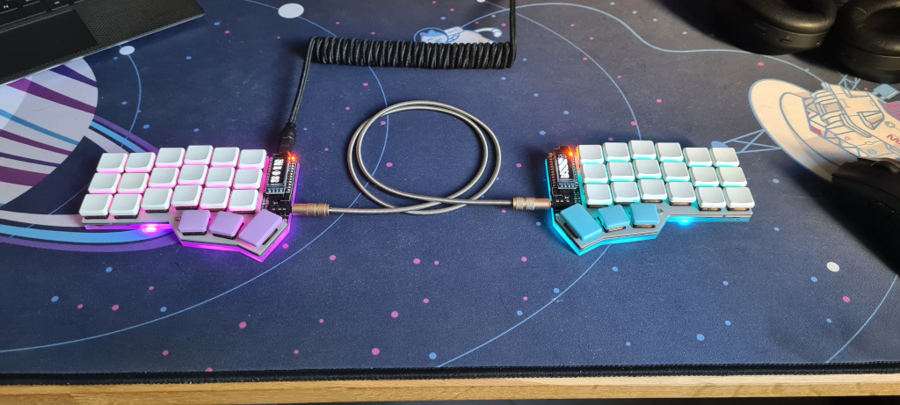
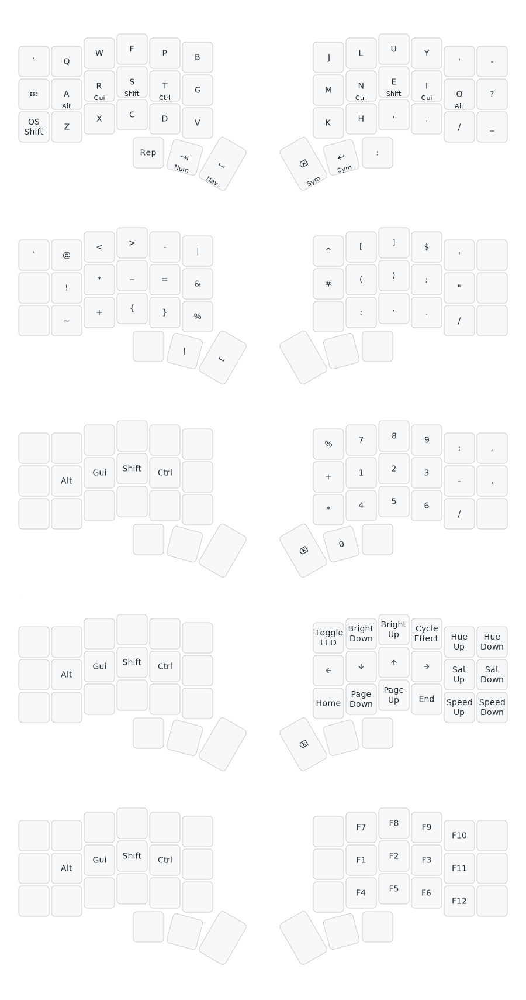

# ⌨️ Keyboards

My [QMK](https://qmk.fm/) keymaps for the Aurora Corne, Kyria and Skeletyl.



## Design goals

Only one design goal: "absolute comfort" to type English and for programming in vim, mainly in Python.
If it can look cool as well, that's a nice bonus!

## Keymap

Here is a visualization, see [keymap.c](qmk/keyboards/splitkb/aurora/corne/keymaps/diaoul/keymap.c) for the keymap and [diaoul.c](qmk/users/diaoul/diaoul.c) for full details!



## Choices

Custom keyboard is all about tradeoffs...

### Layout

- I switched to Colemak-DH in 2021. Now there are many better alternatives, I strongly encourage reading [this guide](https://getreuer.info/posts/keyboards/alt-layouts/index.html)
- I'm not into layouts with an alpha on the thumb
- I really dislike reaching for keys diagonally with either the pinky or the index finger, especially down as it makes my whole hand move
- I mainly use 2 thumb keys, more is awkward for me to reach
- ``,.'-_/\`?:`` I value those symbols on my main layer as I type them often

### Modifiers

- Home row mods are awesome but require quite the fine tuning to avoid misfires
- I like layers taps on the thumbs but repeating becomes impossible, especially hard to get used to for backspace
- One shot shift is very comfortable to use compared to shift on home row but finding a spot for it is hard
- [Caps Word](https://docs.qmk.fm/features/caps_word) is such a wonderful idea

### OLED

This is the rule of cool! I've customized it to have a bit of information on the display when I type: which layer and modifiers are active.

### Combos

I want to love them but the reality is that with a decent layout they easily conflict with rolls for the ones with adjacent keys. Even having played with timings I have a lot of misfires. As for the one that are not on adjacent keys, I find them a bit clunky to type.

### Navigation Layer

I move around with arrow keys on a layer. In combination with home, end and home row mods it gives you a lot of freedom to skip words or go back to the beginning of a line. I've replaced my vim `HJKL` navigation with this, it's not as comfortable but it's an OK compromise to be able to reuse this muscle memory everywhere else.

### Symbol Layer

This is probably the most important layer of them all! I want to be able to reach `@` and `#` easily as they are very important in everyday typing nowadays. I tried a single hand symbol layer in the past but it's too cramped to fit everything.

## Installation

This configuration repository leverages [external userspace](https://docs.qmk.fm/newbs_external_userspace) and makes use of some [community modules](https://docs.qmk.fm/features/community_modules). Follow related [QMK instructions](https://docs.qmk.fm/newbs) to get started.

[mise](https://mise.jdx.dev/) is used to setup the environment, install everything with:

```
mise run install
```

Then, flashing is done with:

```
qmk flash -kb splitkb/aurora/corne -km diaoul
```

To generate visualizations automatically with [keymap-drawer](https://github.com/caksoylar/keymap-drawer), run:

```
mise run draw
```

### Firmware size

I try to be space efficient, especially on pro-micro microcontrollers as they are very limited in space with modern QMK. There are some option in the config that allows to disable some features in order to save space.

See [this page](https://docs.qmk.fm/squeezing_avr) for more about saving space.
